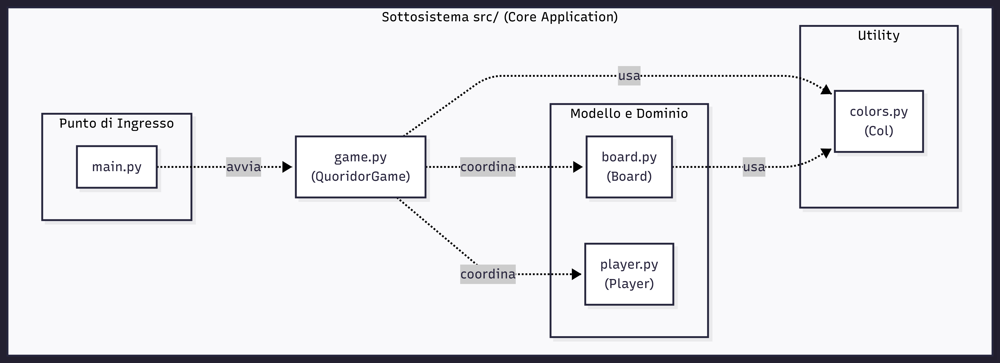

# Relazione Tecnica - Quoridor

## Indice

- [Introduzione](##-1.-Introduzione)
- [Modello di dominio](##-2.-Modello-di-dominio)
- [Requisiti specifici](##-3.-Requisiti-specifici)
- [System design](##-4.-System-design)
- [OO design](##-5.-OO-design)
- [Riepilogo dei test](##-6.-Riepilogo-dei-test)
- [Modalità di collaborazione del team](##-7.-Modalità-di-collaborazione-del-team)
- [Analisi retrospettiva](##-8.-Analisi-retrospettiva)

## 1. Introduzione
Questo documento descrive le scelte progettuali, l'architettura e i requisiti del progetto Quoridor. Il software è un'implementazione in Python del celebre gioco da tavolo, che permette a due giocatori di sfidarsi su una scacchiera 9x9. L'obiettivo è raggiungere il lato opposto della plancia prima dell'avversario, gestendo strategicamente il movimento del proprio pedone e il posizionamento di muri per ostacolare l'altro giocatore.
## 2. Modello di dominio
Il modello di dominio definisce le entità core del gioco e le loro interazioni logiche.
Le entità fondamentali sono:
•	QuoridorGame: L'orchestratore della partita che gestisce i turni, le regole di movimento e la verifica della vittoria.
•	Board: La plancia di gioco che mantiene lo stato dei muri piazzati e si occupa della visualizzazione testuale.
•	Player: Rappresenta l'utente, memorizzando il nome, la posizione corrente sulla scacchiera e il numero di muri ancora disponibili (partendo da 10).

**Diagramma delle Classi**:

    classDiagram
        direction TB

    class View {
        interfaccia visiva
        input utente
    }

    class QuoridorEngine {
        turno corrente
        stato della partita
    }

    class GameState {
        situazione riassuntiva
    }

    class Board {
        dimensione griglia
        muri orizzontali posizionati
        muri verticali posizionati
    }

    class Player {
        nome
        colore
        posizione corrente
        muri in riserva
        obiettivo di vittoria
    }

    class GameTimer {
        regola temporale
    }

    class PlayerTimer {
        tempo residuo
    }

    class Transcript {
        contatore mosse
    }

    class MoveRecord {
        numero sequenziale
        tipo di azione
        coordinata algebrica
        istante temporale
    }

    class PlayerSnapshot {
        fotografia posizione
        fotografia muri riserva
    }

    class GameRecord {
        data di inizio
        vincitore
    }

    %% Relazioni con Molteplicità e Verbi (Associazioni)
    View "1" --> "1" QuoridorEngine : interagisce con
    QuoridorEngine "1" --> "1" GameState : genera

    %% Composizioni (rombo pieno)
    QuoridorEngine "1" *-- "1" Board : governa
    QuoridorEngine "1" *-- "2..4" Player : coordina
    QuoridorEngine "1" *-- "1" GameTimer : controlla tempo tramite
    QuoridorEngine "1" *-- "1" Transcript : annota mosse su
    GameTimer "1" *-- "2..4" PlayerTimer : è composto da
    Transcript "1" *-- "*" MoveRecord : accumula
    MoveRecord "1" *-- "2..4" PlayerSnapshot : immortala

    %% Associazioni logiche semplici
    Player "1" --> "1" PlayerTimer : è limitato da
    Transcript "1" --> "1" GameRecord : salva archivio in

## 3. Requisiti specifici

## 3.1 Requisiti funzionali:

**- US 01 — Visualizzare lo stato della scacchiera**

Come giocatore voglio che il terminale stampi a schermo la scacchiera 9x9 aggiornata con tutti i pezzi, in modo da avere la situazione chiara prima di digitare la mia prossima mossa.

Criteri di accettazione:

Il programma stampa una griglia quadrata 9x9, provvista di un sistema di coordinate ai margini
Le caselle in cui non sono presenti pedoni sono riempite da un carattere neutro di riempimento
La posizione esatta dei giocatori è chiaramente indicata dalle etichette P1 (Giocatore 1) e P2 (Giocatore 2).
La rappresentazione visiva deve includere i muri posizionati sulla scacchiera, rendendo evidente la differenza grafica tra un muro orizzontale e uno verticale.
Accanto o sotto la griglia, un contatore testuale riporta l'inventario dei muri ancora a disposizione di entrambi i giocatori.
Il sistema stampa un messaggio esplicito per comunicare di chi è il turno corrente.
Al termine di ogni mossa andata a buon fine, il terminale ristampa l'intera visuale di gioco aggiornata.

**- US 2 — Muovere il pedone**

Come giocatore voglio inserire le coordinate della casella di destinazione sul terminale, in modo da spostare il mio pedone sulla scacchiera.

Criteri di accettazione:

Il giocatore inserisce un comando testuale
Lo spostamento è consentito solo in verticale o in orizzontale di una singola casella alla volta
Il pedone non può oltrepassare i muri piazzati né uscire dai confini della griglia 9x9.
Se la mossa inserita non è valida, il terminale mostra un messaggio di errore specifico (es. "Mossa non valida: muro presente") e richiede nuovamente l'inserimento, senza far saltare il turno.

**- US 3 — Piazzare i muri orizzontali e verticali**

Come giocatore voglio inserire le coordinate per piazzare un muro orizzontale o un muro verticale sul terminale, in modo da sbarrare la strada al mio avversario.

Criteri di accettazione

Il giocatore inserisce un comando che specifica la posizione e l'orientamento (orizzontale o verticale).
Il muro posizionato deve coprire esattamente l'interstizio tra due caselle adiacenti.
Il giocatore deve avere ancora muri a disposizione (contatore > 0), altrimenti il terminale mostra un messaggio di errore.
Il muro non può sovrapporsi né incrociarsi con muri già presenti sulla scacchiera.
Il posizionamento non deve chiudere del tutto i percorsi dell'avversario verso la sua linea di meta
Se la mossa è valida, il contatore dei muri del giocatore diminuisce di 1 e il turno passa all'avversario.

**- US 4 — Setup finale**

In qualità di giocatore voglio poter avviare l'intero gioco da un unico punto di accesso principale (classe main) e avere un'interfaccia testuale rifinita

Criteri di accettazione:
• Il file/classe principale (main.py) avvia correttamente il ciclo di gioco collegando tutte le classi precedenti.
• All'avvio del programma, viene stampato a schermo il titolo "Quoridor" in modo chiaro.
• È implementata una funzione per la pulizia dello schermo del terminale che mantenga la console ordinata tra un turno e l'altro.
• Il codice generale è stato revisionato per rimuovere eventuali stampe di debug superflue e garantire un flusso senza interruzioni.

**- US 5 — Verificare la vittoria**

Come giocatore voglio che il sistema controlli le condizioni di vittoria dopo ogni mossa, in modo da terminare la partita quando l'obiettivo viene raggiunto.

Criteri di accettazione:

Il controllo avviene automaticamente senza bisogno di comandi da parte dei giocatori.
Se il pedone del Giocatore 1 raggiunge una qualsiasi casella della riga 9 (o viceversa la riga 1 per il Giocatore 2), la partita si interrompe.
Il terminale stampa un messaggio chiaro di vittoria
Il gioco smette di accettare comandi di movimento e chiede se si vuole tornare al menu o uscire.

**- US 6 — Abbandonare la partita**

Come giocatore voglio poter digitare un comando di resa sul terminale durante il mio turno, in modo da ritirarmi dalla partita.

Criteri di accettazione:

Il giocatore digita un comando testuale specifico (es. "abbandona")
Il gioco interrompe immediatamente il turno corrente.
Sul terminale viene stampato un messaggio che dichiara vincitore l'avversario a tavolino per ritiro.
La partita in corso viene terminata.

**- US 7 — Mostrare un messaggio di aiuto**

Come giocatore voglio poter digitare un comando di aiuto sul terminale in qualsiasi momento, in modo da consultare la lista dei comandi disponibili.

Criteri di accettazione:

Digitando un comando specifico (es. help), il terminale stampa un elenco formattato con tutti i comandi di gioco supportati e una breve spiegazione.
L'utilizzo di questo comando non viene considerato come una mossa e non fa passare il turno all'avversario.
Dopo aver stampato l'aiuto, il sistema rimane in attesa del comando di gioco del giocatore corrente.

**- US 8 — Uscire dal gioco**

Come giocatore voglio poter digitare un comando di uscita sul terminale, in modo da chiudere l'applicazione in modo sicuro.

Criteri di accettazione:

Digitando un comando specifico (es. esci o quit), il programma termina immediatamente l'esecuzione.
Il terminale del Mac ritorna al suo prompt dei comandi standard, senza mostrare stringhe di errore o eccezioni del codice.

**- US 10 — Aggiunta di un limite di tempo per la partita**
In qualità di giocatore, voglio poter impostare un limite di tempo per i turni o per l'intera partita, in modo tale da rendere le sfide più veloci e competitive.

Criteri di accettazione:
• All'avvio del gioco, il sistema permette di scegliere se attivare o meno la modalità a tempo.
• Se attivato, il timer scorre in tempo reale e il tempo rimanente è visibile nell'interfaccia (o aggiornato a ogni input).
• Se il tempo a disposizione di un giocatore scade durante il suo turno, il sistema interrompe la partita e assegna la vittoria all'avversario.
• L'implementazione del timer non blocca l'inserimento dei comandi da tastiera.

**- US 11 — Replay di una partita conclusa e visualizzazione della trascrizione delle mosse**
In qualità di giocatore, voglio visualizzare e salvare la trascrizione di tutte le mosse effettuate, in modo tale da avere uno storico della partita e poter analizzare le strategie usate, e voglio poter caricare la trascrizione di una partita precedente e farne partire il replay, in modo tale da rivedere l'evoluzione della scacchiera passo dopo passo.

Criteri di accettazione:
• Il sistema registra ogni mossa valida (movimento del pedone o piazzamento di un muro) in una notazione standard (es. coordinata di arrivo o tipo/posizione del muro).
• Durante la partita, i giocatori possono digitare un comando (es. log o history) per stampare a schermo l'elenco delle mosse giocate fino a quel momento.
• Al termine della partita, la trascrizione completa viene salvata in un file di testo dedicato (es. match_history.txt).
• Il sistema prevede una modalità "Replay" accessibile all'avvio del programma.
• L'utente può specificare il file della partita da riprodurre.
• Il sistema riproduce le mosse in ordine cronologico, aggiornando la scacchiera a schermo.
• L'utente può avanzare alla mossa successiva premendo un tasto (es. Invio) o usare comandi per andare avanti/indietro.

**- US 12 — Modalità multiplayer a 4 giocatori**
In qualità di giocatore voglio poter impostare una partita con 4 partecipanti

Criteri di accettazione:
• All'avvio del gioco è possibile selezionare la modalità a 2 o a 4 giocatori.
• Nella modalità a 4, la scacchiera inizializza 4 pedoni posizionati al centro dei 4 lati del tabellone.
• Il contatore iniziale dei muri per ogni giocatore è impostato a 5 (invece di 10).
• Il sistema di turni ruota ciclicamente tra i 4 giocatori.
• La condizione di vittoria è aggiornata: ogni giocatore vince se raggiunge un qualsiasi punto del lato opposto a quello di partenza.

**- US 13 — Avvio del gioco con un interfaccia grafica avanzata**
In qualità di giocatore, voglio poter avviare il gioco con un'interfaccia grafica avanzata al posto del terminale

Criteri di accettazione:
• Il sistema supporta un flag da riga di comando per la modalità grafica. Digitando sul terminale del Mac il comando python3 main.py --gui, il gioco si avvia in una finestra dedicata usando la libreria PyQt6
• Senza il flag --gui, il gioco continua a funzionare perfettamente nel terminale (CLI).
• La GUI renderizza correttamente la griglia 9x9, i pedoni e i muri in 2D.
• I giocatori possono cliccare con il mouse per selezionare la casella di destinazione del pedone o l'intersezione in cui piazzare il muro.
• La logica di base (vittoria, regole di movimento, esaurimento muri) rimane invariata e condivisa tra CLI e GUI.

## 3.2 Requisiti non funzionali

• RNF1 (Usabilità): Il sistema deve garantire un'interfaccia chiara, ordinata e facilmente leggibile per l'utente durante tutte le fasi di gioco, fornendo un'esperienza coerente sia nella classica modalità a riga di comando (CLI) sia nella nuova visualizzazione grafica avanzata (GUI).

• RNF2 (Portabilità): Il sistema deve essere indipendente dalla piattaforma e poter essere eseguito senza problemi sui principali sistemi operativi, evitando conflitti di dipendenze anche per quanto concerne le librerie grafiche aggiuntive.

• RNF3 (Manutenibilità): Il codice sorgente deve rispettare gli standard di formattazione della community Python, risultando facilmente leggibile e predisposto a future estensioni 

• RNF4 (Efficienza): Il sistema deve validare le mosse in tempi non percettibili dall'utente, garantendo fluidità.

• RNF5 (Affidabilità/Robustezza): Il sistema deve gestire input errati o non validi mostrando messaggi di errore chiari senza causare crash. Inoltre, deve garantire la persistenza sicura e strutturata dei dati.

## 4. System Design

**4.1 Stile Architetturale**

Abbiamo adottato il pattern architetturale Model-View-Controller (MVC). Questo stile è particolarmente indicato per i sistemi interattivi,perche separa nettamente la logica di presentazione dei dati dalla logica di business:

•	Model : Include le classi che rappresentano il dominio dell'applicazione:

*	Board (da board.py): Memorizza la struttura del campo da gioco (dimensioni) e i set (set()) delle coordinate dove sono fisicamente piazzati i muri orizzontali e verticali.
*	Player (da player.py): Contiene lo stato del singolo partecipante: nome, colore, posizione corrente sulla griglia, numero di muri rimasti in riserva e riga/colonna obiettivo per la vittoria.
*	GameTimer e PlayerTimer (da timer.py): Si occupano esclusivamente del calcolo numerico dei secondi a disposizione e della gestione dei preset (es. Bullet, Blitz).
*	Transcript, GameRecord, MoveRecord, PlayerSnapshot (da transcript.py): Sono le strutture dati (principalmente dataclass) adibite alla memoria storica. Registrano le coordinate delle mosse, gli istanti temporali e creano un fascicolo salvabile della partita.
        
•	View : È responsabile della rappresentazione visuale dei dati:

*    Interfaccia CLI (src/view/)
*	View (da view.py): Si occupa interamente della stampa testuale. Formatta la scacchiera in ASCII art, gestisce i codici colore ANSI, mostra i menu e cattura l'input da tastiera (es. digitazione di "e4" o "PO e4").
    Interfaccia GUI (src/gui/)
*	BoardWidget (da board_widget.py): Disegna fisicamente la griglia di Quoridor, le pedine arrotondate, i muri al neon e rileva i click del mouse tramite i metodi di PyQt/PySide.
*	MainWindow (da main_window.py): Il contenitore principale che aggrega l'intero layout grafico della partita in corso.
*	TimerWidget e TranscriptWidget (e MoveRow): Disegnano rispettivamente i display digitali del conto alla rovescia e la lista scorrevole delle mosse effettuate.
*	ReplayDialog (da replay_dialog.py): La finestra secondaria adibita alla navigazione visuale delle partite salvate nello storico.
        
•	Controller : Gestisce la sequenza di interazioni con l'utente, accetta l'input testuale e lo trasforma in comandi per il Modello o la Vista:

*	QuoridorEngine (da game_engine.py): È il nucleo delle regole (Business Logic). È qui che viene verificato se un muro è valido, se uno spostamento è legale (puoi_muovere) ed è qui che risiede l'algoritmo di ricerca (BFS in esiste_percorso) per impedire che un giocatore venga chiuso completamente.
*	GameState (da game_engine.py): Una classe di "trasporto". Impacchetta la situazione calcolata dall'Engine per passarla in sicurezza alla View senza che quest'ultima debba spulciare nei calcoli complessi.
*	QuoridorGame (da game.py): Gestisce il loop procedurale della modalità terminale. Coordina i passaggi: chiede l'input alla View, lo passa al QuoridorEngine per la convalida, elabora le eccezioni o i timeout, e comanda nuovamente alla View di aggiornare lo schermo.

**4.2 Principi di progettazione per il cambiamento**

L'architettura è stata pensata per minimizzare l'impatto di future modifiche, seguendo i principi di progettazione per il cambiamento:

•	Presentazione separata: La parte di codice relativa alla presentazione visiva è stata tenuta separata dal resto dell'applicazione per esempio è stata isolata la logica di calcolo dalla stampa a schermo.

•	Obiettivo di alta coesione: Abbiamo assegnato le responsabilità in modo tale da ottenere componenti con compiti ben definiti. Ad esempio, la classe Player ha l'unica responsabilità di gestire le proprie statistiche e verificare il raggiungimento della riga obiettivo (has_won()), delegando il resto al Controller.

•	Principio di Information Hiding: Ogni componente custodisce dei segreti al proprio interno (incapsulamento dei dati). I dettagli implementativi di basso livello, come i set contenenti le coordinate dei muri (h_muri, v_muri), sono nascosti all'interno di Board ed esposti al Controller solo per aggiornamenti controllati.

**4.3 Diagramma dei Package**

Nel nostro sistema, il package "Main" funge da client assoluto, mentre il cuore del gioco gestisce le entità base.

    flowchart TD
    
    
    
    subgraph src [" Sottosistema src/ (Core Application) "]
    
        subgraph root [" Punto di Ingresso "]
            Main["src/main.py"]
        end
    
        subgraph gui_pkg [" Interfaccia Grafica "]
            GUI["src/gui/"]
        end
    
        subgraph controller_pkg [" Logica e Regole "]
            Controller["src/controller/"]
        end
    
        subgraph view_pkg [" Interfaccia Terminale "]
            View["src/view/"]
        end
    
        subgraph base_pkg [" Moduli Base e Utility "]
            Colors["src/colors.py"]
            Timer["src/timer.py"]
            Transcript["src/transcript.py"]
            Replay["src/replay.py"]
        end
    
        subgraph model_pkg [" Modello e Dominio "]
            Model["src/model/"]
        end
    
    end
    
    %% Dipendenze dal punto di ingresso principale
    Main -.->|importa| GUI
    Main -.->|importa| Controller
    Main -.->|importa| View
    
    %% Dipendenze dell'interfaccia grafica
    GUI -.->|importa| Controller
    GUI -.->|importa| Model
    GUI -.->|importa| base_pkg
    
    %% Dipendenze del coordinatore della logica
    Controller -.->|importa| View
    Controller -.->|importa| Model
    Controller -.->|importa| base_pkg
    
    %% Dipendenze della vista da terminale
    View -.->|importa| Model
    View -.->|importa| base_pkg
    
    %% Dipendenze dei moduli di base
    base_pkg -.->|importa| Model

**4.4 Scelte Progettuali**

Il team ha preso le seguenti decisioni di progetto:

* **Interfaccia (View):** Per garantire l'usabilità (RNF1), si è scelto di utilizzare le sequenze di escape (colori ANSI) per differenziare visivamente i giocatori e i muri, e di effettuare il clear del terminale a ogni turno per simulare un'interfaccia statica.
* **Containerizzazione:** Per soddisfare il requisito di portabilità (RNF2), abbiamo optato per la containerizzazione tramite **Docker**, creando un ambiente di esecuzione isolato e identico su qualsiasi macchina.
* **Qualità del Codice:** Per assicurare la manutenibilità (RNF3), abbiamo integrato nel nostro flusso di lavoro il linter **Ruff**, che ha imposto e verificato automaticamente il rispetto delle convenzioni architetturali PEP 8.

## 5. OO design (objected-oriented design)

**5.1 Diagramma delle Classi (Prospettiva Software)**

    classDiagram
        direction TB

    class QuoridorGame {
        +QuoridorEngine engine
        +View view
        +GameTimer game_timer
        +Transcript transcript
        +int num_giocatori
        +play()
        +cambia_turno()
        +controlla_mossa_singola(...) bool
        -_registra(tipo: str, coordinata: str)
        -_salva_partita(vincitore: str)
        -_gestisci_timeout()
    }

    class QuoridorEngine {
        +list~Player~ giocatori
        +int turno_idx
        +bool self_finita
        +str self_vincitore
        +nuova_partita(nomi: list)
        +muovi(nr: int, nc: int) MoveResult
        +piazza_muro(tipo: str, r: int, c: int) WallResult
        +puoi_muovere(p_partenza, p_arrivo) bool
        +esiste_percorso(pos, giocatore: Player) bool
        +tutti_hanno_percorso() bool
        -muro_valido(tipo: str, r: int, c: int) bool
    }

    class Board {
        +int size
        +set h_muri
        +set v_muri
        +draw(giocatori: list)
    }

    class Player {
        +str name
        +str symbol
        +str color
        +list pos
        +int muri
        +str target
        +target_row() int
        +target_col() int
        +has_won() bool
        +place_wall() bool
    }

    class View {
        +stampa_griglia(board: Board, giocatori: list)
        +chiedi_input(prompt: str) str
        +stampa_aiuto()
        +stampa_menu()
        +stampa_errore(msg: str)
    }

    class Transcript {
        +GameRecord self_record
        +int self_counter
        +registra(giocatore: str, tipo: str, coordinata: str)
        +salva() str
        +mosse() list~MoveRecord~
    }

    class GameTimer {
        +dict PRESETS
        +list~PlayerTimer~ timers
        +int self_active
        +switch(to: int)
        +stop(idx: int)
    }

    QuoridorGame "1" *-- "1" QuoridorEngine : coordina
    QuoridorGame "1" *-- "1" View : I/O
    QuoridorGame "1" *-- "1" Transcript : usa
    QuoridorGame "1" *-- "1" GameTimer : usa
    QuoridorEngine "1" *-- "1" Board : verifica regole su
    QuoridorEngine "1" *-- "2..4" Player : gestisce

**5.2 Diagrammi di Sequenza per le User Story più Importanti**

Diagramma 1: Movimento Pedone e Controllo Vittoria (US 2 + US 5)

Questo diagramma mostra come il sistema processa l'input di movimento di un utente, valida la richiesta rispetto ai limiti della scacchiera e ai muri, e verifica automaticamente se la mossa porta alla vittoria.

    sequenceDiagram
        actor Utente
        participant V as View
        participant QG as QuoridorGame
        participant QE as QuoridorEngine
        participant P as Player

    Utente->>V: Inserisce "e4" (mossa)
    V-->>QG: Ritorna stringa "e4"
    QG->>QE: muovi(riga, colonna)
    
    activate QE
    QE->>QE: puoi_muovere(partenza, arrivo)
    
    alt Mossa Legale
        QE->>P: Aggiorna pos (riga, colonna)
        QE->>P: has_won()
        
        alt Vittoria raggiunta (US 5)
            P-->>QE: Ritorna True
            QE-->>QG: MoveResult.VINTO
            QG->>V: stampa_errore("VINCE [Nome]")
        else Partita continua
            P-->>QE: Ritorna False
            QE-->>QG: MoveResult.OK
            QG->>QG: cambia_turno()
            QG->>V: stampa_griglia()
        end
        
    else Mossa Illegale (es. muro o fuori scacchiera)
        QE-->>QG: MoveResult.NON_VALIDO
        QG->>V: stampa_errore("Mossa non valida")
        V-->>Utente: Mostra Errore
    end
    deactivate QE

Diagramma 2: Piazzamento Muro e Controllo Percorso (US 3)

Questo diagramma è cruciale perché mostra l'invocazione dell'algoritmo di ricerca (BFS) per garantire che un muro non blocchi mai completamente il percorso verso l'obiettivo.

    sequenceDiagram
        actor Utente
        participant V as View
        participant QG as QuoridorGame
        participant QE as QuoridorEngine
        participant B as Board
        participant P as Player

    Utente->>V: Inserisce "PO e4"
    V-->>QG: Ritorna comando
    QG->>QE: piazza_muro("PO", riga, colonna)
    
    activate QE
    QE->>QE: _muro_valido(tipo, r, c)
    
    alt Spazio libero
        QE->>B: Aggiunge temporaneamente il muro nei set
        QE->>QE: tutti_hanno_percorso()
        note right of QE: Esegue BFS (esiste_percorso) per ogni giocatore
        
        alt Il percorso esiste
            QE->>P: place_wall() (decrementa muri residui)
            P-->>QE: True
            QE-->>QG: WallResult.OK
            QG->>QG: cambia_turno()
        else Percorso completamente bloccato
            QE->>B: Rimuove il muro dai set (rollback)
            QE-->>QG: WallResult.BLOCCA_PERCORSO
            QG->>V: stampa_errore("Non puoi bloccare il percorso!")
        end
    else Muro già presente
        QE-->>QG: WallResult.NON_VALIDO
        QG->>V: stampa_errore("Muro non valido")
    end
    deactivate QE

**5.3 Commento sulle Decisioni con Riferimento ai Principi di OO Design**

*	Alta Coesione (High Cohesion): Ogni classe ha una sola responsabilità ben focalizzata ed evita di farsi carico di compiti estranei. La Board gestisce solo la griglia e i muri inseriti; Player memorizza solo lo stato del singolo giocatore; i file dei timer calcolano solo lo scorrere dei secondi.

*	Basso Accoppiamento (Low Coupling): Le classi comunicano attraverso interfacce snelle e non sono strettamente dipendenti dai dettagli interni l'una dell'altra. Ad esempio, la componente di visualizzazione (View) non conosce l'algoritmo BFS utilizzato per controllare l'isolamento dei percorsi, ma si limita a mostrare i dati. Questo vi ha permesso di separare nettamente lo sviluppo della CLI da quello della GUI, potendo cambiare interfaccia senza modificare la logica delle regole.

*	Information Expert: Le responsabilità di calcolo sono state assegnate alle classi che possiedono le informazioni necessarie per completarle. Ad esempio, il controllo sulla condizione di vittoria (has_won()) o il decremento dei muri residui risiedono direttamente nella classe Player, in quanto custode naturale del proprio stato interno.

**5.4 Applicazione di Design Pattern**

1. Pattern Facade (Strutturale)

*	Problema teorico: Come è possibile fornire un'interfaccia semplice per un sottosistema complesso? Fornire un'interfaccia unificata di più alto livello rispetto alle interfacce del sottosistema.

    `Applicazione nel codice: La classe QuoridorEngine implementa perfettamente il pattern Facade. Il controllo delle regole di Quoridor è estremamente complesso (richiede di controllare coordinate incrociate sui set della classe Board, calcolare salti dei pedoni e lanciare algoritmi grafi BFS come esiste_percorso()). Se il controllore principale (QuoridorGame) dovesse fare tutto questo, il codice sarebbe illeggibile. Invece, l'Engine fa da "Facciata", esponendo al QuoridorGame metodi semplici e ad alto livello come muovi() e piazza_muro(), nascondendo al suo interno tutta la complessità matematica e algoritmica.`

2. Pattern Memento (Comportamentale)

*	Problema teorico: Senza violare l'incapsulamento, come può lo stato interno di un oggetto essere catturato ed esternalizzato in modo tale che l'oggetto possa essere successivamente ripristinato a quello stato.

    `Applicazione nel codice: Abbiamo utilizzato questo pattern per soddisfare la US 11 (Replay della partita). Attraverso le classi del modulo transcript.py (GameRecord, MoveRecord e in particolare PlayerSnapshot), il sistema cattura un'istantanea esatta (Snapshot/Memento) delle posizioni dei pedoni e dei muri a ogni singola mossa, archiviandoli senza alterare lo stato in corso. La classe ReplayEngine e il ReplayDialog ricaricano gli oggetti di stato salvati e passandoli al tabellone per far "tornare indietro nel tempo" la partita e riprodurre lo stato precedente.`

## 6. Riepilogo dei test

## 7. Modalità di collaborazione del team

Al fine di ottimizzare il ciclo di sviluppo per l'ampliamento del codice base del gioco, il team ha adottato un approccio ispirato ai principi dello sviluppo agile  mantenendo un approccio estremamente pratico e snello, evitando di l'utilizzo di troppi tool di gestione esterni (es. board complesse come Jira o Trello) e concentrandoci sul lavoro effettivo. Inoltre il gruppo ha strutturato la collaborazione coniugando momenti formali di coordinamento, l'uso di canali di comunicazione immediati e l'applicazione rigorosa dei flussi di gestione della configurazione del software.

**Gestione del codice e flusso di lavoro**

Il cuore pulsante del nostro progetto è stata la piattaforma GitHub. Inoltre c'è stato l'affiancamento dei propri ambienti locali sui quali ogni membro del gruppo ha lavorato in autonomia. Per consentire l'isolamento dello sviluppo delle diverse funzionalità, evitando sovrascritture accidentali del codice e minimizzando l'insorgenza di conflitti di merge, il team ha adottato in modo sistematico il modello del GitHub Flow:

1.⁠    ciascuna macro-task o funzionalità da implementare è stata associata a un'attività specifica e ogni componente del gruppo ha lavorato in isolamento all'interno di un branch dedicato ad essa effettuando commit frequenti inerenti alle modifiche attuate, mantenendo così sempre stabile il ramo principale.
    
2.⁠    una volta completata la propria funzionalità è stato effettuato il push sul repository remoto, aprendo contestualmente una Pull Request.  Questo ci dava modo di controllare le modifiche fatte, di capire a che punto dell’attività assegnata fossero ogni membro e di integrare gli aggiornamenti nel progetto in modo sicuro e ordinato.
    
3.⁠    ⁠solo a seguito del feedback positivo con approvazione del/dei reviewer si è proceduto alla fusione (merge) del codice nel ramo principale.

**Comunicazione e sincronizzazione**

La sincronizzazione del team è stata strutturata ricalcando in modo agile i principali eventi del framework Scrum: 

*   ⁠Sprint Planning (Pianificazione dell'iterazione): all'inizio di sprint, il team si è riunito in videocall tramite la piattaforma Google Meet. In questa sede sono stati analizzati i requisiti del codice base, pianificate le estensioni necessarie e distribuiti informalmente i task tra i componenti.
    
*   ⁠Daily Scrum asincrono: la comunicazione quotidiana e operativa è stata interamente affidata a un canale dedicato su WhatsApp, concepito come un vero e proprio "ufficio virtuale". Questo strumento ha consentito di mantenere un allineamento continuo coordinando in tempo reale le notifiche di apertura delle Pull Request, lo scambio rapido di pareri tecnici sulla risoluzione di bug bloccanti e la rimozione immediata di eventuali ostacoli allo sviluppo.
    
*   ⁠Sprint Review e Retrospective (Verifica finale): alla conclusione di ogni sprint, prima della sottomissione degli avanzamenti, il team si è riunito nuovamente su Google Meet per un collaudo collettivo del software funzionante. Durante queste sessioni è stato verificato che l'incremento di codice soddisfacesse tutti i requisiti di correttezza e è stato analizzato l'andamento del processo collaborativo per individuare e applicare tempestivamente azioni correttive nelle iterazioni successive.

## 8. Analisi retrospettiva

Abbiamo svolto senza molte difficolta tutte le issue assegnate dimostrando familiarità da parte del team con gli strumenti Git , il GitHub Flow e i processi di base dello sviluppo Agile.

**8.1 Sprint 0**

**Analisi dei problemi e azioni correttive:**

Durante la revisione del lavoro, sono emerse soltanto alcune problematiche rispetto alle best practice attese, che abbiamo analizzato per migliorare il flusso nei prossimi Sprint.

•	Problema 1 (Rilevanza: maggiore): Tracciabilità dei commit e profili non linkati. È stato rilevato che i commit non provenivano da profili locali non correttamente collegati agli account GitHub ufficiali dei membri del team.

`•	Azione Correttiva: Prima di iniziare lo Sprint 1, ogni membro del team ha eseguito una verifica sul terminale del proprio computer per assicurarsi che le credenziali Git locali siano esatte. Abbiamo utilizzato il comando git config --global user.email per allinearli ai profili Github`

•	Problema 2 (Rilevanza: minore): Accumulo di branch aperti. Al termine dello Sprint è stata notata la presenza di molteplici branch ancora aperti nel repository remoto, nonostante le relative issue fossero state chiuse.

`•	Azione Correttiva: Abbiamo integrato una nuova regola nel nostro GitHub Flow interno. D'ora in avanti, chiunque effettui il merge di una Pull Request nel branch main avrà anche la responsabilità di eliminare immediatamente il branch obsoleto.`

**8.2 Sprint 1**

•    Problema 1 (Rilevanza: maggiore): Modello di dominio espresso da un diagramma delle classi con prospettiva software. Avevamo presentato un modello di dominio troppo vicino al codice reale. Avevamo inserito tipi di dato (come int, string), metodi implementativi e dettagli tecnici, confondendo l'astrazione concettuale con la progettazione software vera e propria.

`•	Azione correttiva: Abbiamo ridisegnato da zero il modello di dominio adottando una rigorosa prospettiva concettuale. Abbiamo eliminato ogni riferimento ai tipi primitivi e ai metodi, concentrandoci esclusivamente sulle entità del mondo reale (es. Board, Player, Muro) e sulle loro relazioni logiche (associazioni etichettate con verbi come "ospita", "è limitato da"), rendendo il diagramma totalmente indipendente dal codice.`

•    Problema 2 (Rilevanza: maggiore): Incoerenza tra lo stile MVC dichiarato, l'organizzazione del codice e il diagramma dei package. Pur avendo dichiarato di voler utilizzare il pattern architetturale Model-View-Controller, la suddivisione fisica dei file nelle cartelle non rispettava appieno questo standard.

`•	Azione correttiva: Abbiamo effettuato un profondo refactoring del codice sorgente. Abbiamo separato rigidamente le directory in src/model/, src/view/, src/gui/ e src/controller/. Ci siamo assicurati che il Modello contenesse solo classi di dati pure (totalmente isolato dalle interfacce), che le View gestissero solo l'I/O e che il Controller fungesse da reale mediatore. Infine, abbiamo aggiornato il diagramma dei package per mostrare il corretto flusso unidirezionale delle dipendenze (ad esempio, la View che importa il Model, ma mai viceversa).`

•    Problema 3 (Rilevanza: minore): Aggiunti requisiti non funzionali non richiesti che sono in realtà decisioni di progetto. Nel documento dei requisiti nella categoria "requisiti non funzionali" avevamo inserito requisiti non funzionali che, in realtà, rappresentavano delle nostre scelte progettuali.

`•	Azione correttiva: Abbiamo aggiornato il catalogo dei requisiti, rimuovendo i vincoli tecnologici dalla sezione dei requisiti non funzionali e li abbiamo spostat correttamente nella sezione dedicata alle "scelte progettuali" e all'architettura software.`

•    Problema 4 (Rilevanza: minore): Notazione del diagramma dei package non coerente con il nome del diagramma. Gli identificatori utilizzati per rappresentare visivamente alcuni package non erano coerenti in realtà con quelli utilizzati nel codice del diagramma dei package.

`•	Azione correttiva: Abbiamo aggiornato la grafica del diagramma utilizzando i corretti identificatori che rappresentavano i package e inoltre abbiamo implementato la sintassi e la notazione UML standard per i package, utilizzando l'apposito stereotipo <<package>> per definire i raggruppamenti logici (le nostre cartelle principali) e esplicitando le dipendenze utilizzando le frecce tratteggiate con lo stereotipo <<import>>.`

•    Problema 5 (Rilevanza: minore): Il milestone dello Sprint 0 non è stato chiuso. Sulla nostra repository GitHub, il milestone associato allo Sprint 0 era rimasto erroneamente in stato "aperto".

`•	Azione correttiva: Abbiamo immediatamente provveduto a chiudere il milestone dello Sprint 0 su GitHub. Per assicurarci che questa disattenzione non si ripeta, abbiamo stabilito una nuova regola interna: al termine di ogni sprint, durante il momento di allineamento finale, ci assicuriamo di fare un controllo incrociato per verificare che tutte le issue associate siano state completate e che il milestone corrente venga ufficialmente chiuso.`

