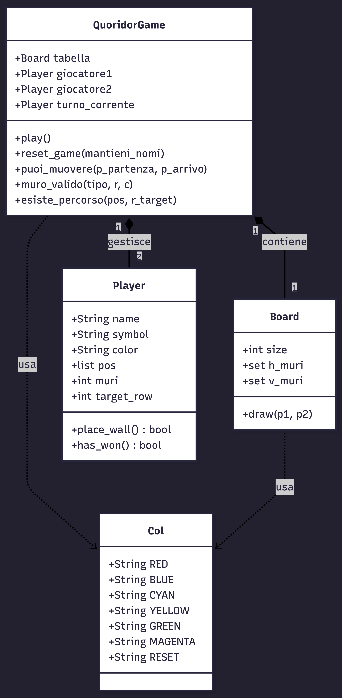

Relazione Tecnica - Quoridor
1. Introduzione
Questo documento descrive le scelte progettuali, l'architettura e i requisiti del progetto Quoridor. Il software è un'implementazione in Python del celebre gioco da tavolo, che permette a due giocatori di sfidarsi su una scacchiera 9x9. L'obiettivo è raggiungere il lato opposto della plancia prima dell'avversario, gestendo strategicamente il movimento del proprio pedone e il posizionamento di muri per ostacolare l'altro giocatore.
2. Modello di dominio
Il modello di dominio definisce le entità core del gioco e le loro interazioni logiche.
Le entità fondamentali sono:
•	QuoridorGame: L'orchestratore della partita che gestisce i turni, le regole di movimento e la verifica della vittoria.
•	Board: La plancia di gioco che mantiene lo stato dei muri piazzati e si occupa della visualizzazione testuale.
•	Player: Rappresenta l'utente, memorizzando il nome, la posizione corrente sulla scacchiera e il numero di muri ancora disponibili (partendo da 10).
•	Col: Un modulo di utilità per gestire i colori ANSI nel terminale, migliorando l'usabilità dell'interfaccia.

Diagramma delle Classi
classDiagram
    class QuoridorGame {
        +Board tabella
        +Player giocatore1
        +Player giocatore2
        +Player turno_corrente
        +play()
        +reset_game(mantieni_nomi)
        +puoi_muovere(p_partenza, p_arrivo)
        +muro_valido(tipo, r, c)
        +esiste_percorso(pos, r_target)
    }
    
    class Board {
        +int size
        +set h_muri
        +set v_muri
        +draw(p1, p2)
    }
    
    class Player {
        +String name
        +String symbol
        +String color
        +list pos
        +int muri
        +int target_row
        +place_wall() bool
        +has_won() bool
    }
    
    class Col {
        +String RED
        +String BLUE
        +String CYAN
        +String YELLOW
        +String GREEN
        +String MAGENTA
        +String RESET
    }

    QuoridorGame "1" *-- "1" Board : contiene
    QuoridorGame "1" *-- "2" Player : gestisce
    QuoridorGame ..> Col : usa
    Board ..> Col : usa

4. Requisiti specifici
3.1 Requisiti funzionali
•	Inizializzazione: Il sistema permette l'inserimento dei nomi per due giocatori e l'assegnazione automatica dei colori.
•	Visualizzazione: La scacchiera viene stampata nel terminale dopo ogni mossa, mostrando pedine e muri.
•	Movimento: I giocatori possono muovere il pedone di una casa (orizzontale o verticale).
•	Piazzamento Muri: Possibilità di inserire muri orizzontali o verticali che occupano due spazi, verificando che non si sovrappongano e che non blocchino completamente il passaggio.
•	Vittoria: Il sistema rileva automaticamente quando un giocatore raggiunge la riga target.
•	Uscita/Resa: Comandi dedicati per abbandonare la partita o chiudere il programma in modo pulito.
3.2 Requisiti non funzionali
•	Usabilità: L'interfaccia CLI (Command Line Interface) è ottimizzata per la leggibilità grazie all'uso dei colori e alla pulizia dello schermo ad ogni turno.
•	Portabilità: Il progetto include un Dockerfile per garantire l'esecuzione coerente su qualsiasi sistema.
•	Qualità del codice: Il codice rispetta gli standard PEP 8 ed è stato validato tramite il linter Ruff.
5. System Design
L'architettura segue una struttura modulare orientata agli oggetti per garantire la manutenibilità e la separazione delle responsabilità.
•	Stile architetturale: Abbiamo adottato un approccio modulare in cui la logica di visualizzazione (UI) è contenuta prevalentemente in board.py, mentre la logica di business risiede in game.py.
•	Principi di progettazione: È stato applicato il principio di Singola Responsabilità (SRP): ogni classe ha un compito specifico (es. Player gestisce solo i dati dell'utente, Board solo la griglia).

Diagramma dei Package
flowchart TD
    Main[main.py]
    
    subgraph "src/"
        Game[game.py]
        Board[board.py]
        Player[player.py]
        Colors[colors.py]
    end

    Main -->|avvia| Game
    Game -->|coordina| Board
    Game -->|coordina| Player
    Game -->|usa| Colors
    Board -->|usa| Colors

    flowchart TD
    Main[main.py]
    
    subgraph "src/"
        Game[game.py]
        Board[board.py]
        Player[player.py]
        Colors[colors.py]
    end

    Main -->|avvia| Game
    Game -->|coordina| Board
    Game -->|coordina| Player
    Game -->|usa| Colors
    Board -->|usa| Colors

8. Analisi retrospettiva
8.1 Sprint 0
Durante lo Sprint 0 il team si è focalizzato sulla configurazione dell'ambiente di sviluppo e sulla definizione dell'architettura di base.
•	Azioni correttive: Nella fase iniziale abbiamo riscontrato alcune difficoltà nella sincronizzazione dei branch su GitHub e nella gestione dei conflitti sui file principali.
•	Soluzione intrapresa: Per risolvere il problema, abbiamo stabilito una politica rigorosa di naming dei branch (es. feature/nome-funzionalità) e l'obbligo di effettuare una Pull Request con revisione obbligatoria da parte di un altro membro del team prima del merge nel main. Questo ha drasticamente ridotto gli errori di integrazione.
